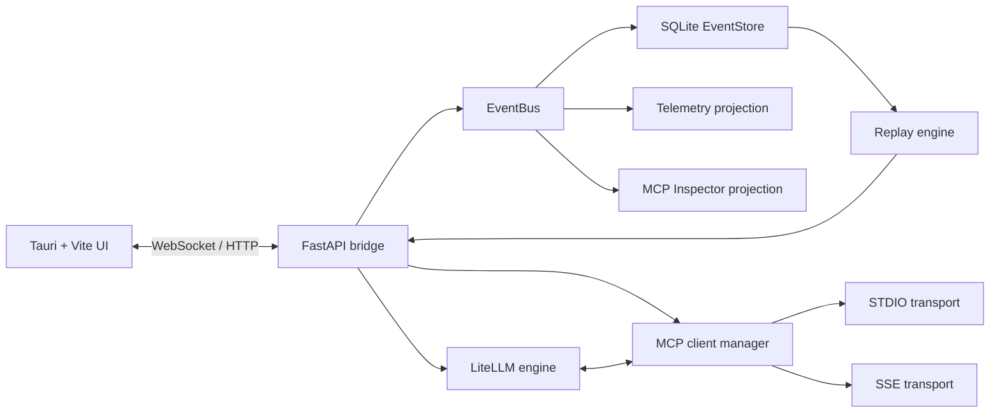

# Hermes

Hermes is an MCP AI IDE Workbench: a desktop application that combines a streaming AI chat surface, multi-server MCP runtime, Postman-style protocol inspection, and replayable event sourcing in one Tauri shell.

## Documentation

- **[UI Architecture Guidelines](UI_ARCHITECTURE.md)** - Complete layout structure, mode system, and design principles
- **[Development Guidelines](CLAUDE.md)** - For AI assistants and developers working on Hermes

## Architecture

Hermes is built around an append-only event log.



Core design points:

- Every significant action emits a typed event with `event_id`, `event_type`, `timestamp`, `session_id`, and `payload`.
- The LLM layer streams tokens and can enter a tool-calling loop against MCP-discovered tools.
- The MCP layer manages multiple servers at once, normalizes tool schemas, and logs raw request/response payloads with latency.
- Replay and branching are derived from the event store, not bolted on after the fact.
- The desktop UI is a thin shell over the backend event stream: the center panel is chat, the left panel is servers/tools, and the right panel is inspection + replay.

## Repository Layout

```text
main.py
config.py
core/
llm/
mcp/
replay/
ui/
desktop/
hermes.example.json
hermes-backend.spec
Makefile
```

## Prerequisites

Hermes has two dependency layers:

- Python and npm for the backend plus frontend assets
- Rust/Cargo for the Tauri desktop shell

On macOS, install the desktop prerequisites first:

```bash
xcode-select --install
brew install rustup-init
rustup-init -y
source "$HOME/.cargo/env"
```

Verify them with:

```bash
make doctor
```

## Quick Start

Set up the project:

```bash
make setup
```

This creates `.venv`, installs Python dependencies, installs desktop dependencies, and seeds `hermes.local.json` from [hermes.example.json](/Users/vmarafioti/devel/hermes/hermes.example.json) if needed.

Update `hermes.local.json` with:

- one LLM mode:
    - hosted API: a LiteLLM model id such as `openai/gpt-4.1-mini` or `anthropic/claude-3-7-sonnet-latest`
        - GitHub Copilot / GitHub Models: a GitHub model id such as `openai/gpt-4.1` plus `api_key_env` pointing to a fine-grained PAT with `models:read`; Hermes uses `https://models.github.ai/inference`
    - local / compatible API: a local model id plus `api_base`, for example `ollama/llama3.1` with `http://127.0.0.1:11434/v1`
    - local CLI: a `cli_command` plus optional `cli_args`, one arg per list item, using `{prompt}` when the CLI expects inline input
- the matching API key environment variable name when the provider needs one
- real MCP server endpoints or commands

GitHub Models example:

```json
{
    "llm": {
        "provider": "github-copilot",
        "model": "openai/gpt-4.1",
        "api_key_env": "GITHUB_TOKEN"
    }
}
```

Start the full desktop app:

```bash
make start
```

Start only the backend:

```bash
make start-backend
```

## Example MCP Config

The repository includes [hermes.example.json](/Users/vmarafioti/devel/hermes/hermes.example.json).

It shows:

- one STDIO server (`filesystem`)
- one SSE server (`remote_demo`)
- one hosted API model configuration

Example excerpt:

```json
{
  "llm": {
        "provider": "openai",
    "model": "openai/gpt-4.1-mini",
    "api_key_env": "OPENAI_API_KEY"
  },
  "mcp_servers": {
    "filesystem": {
      "transport": "stdio",
            "command": "npx",
            "args": ["-y", "@modelcontextprotocol/server-filesystem", ".."]
    },
    "remote_demo": {
      "transport": "sse",
      "url": "http://127.0.0.1:8001/sse"
    }
  }
}
```

## Example Session Flow

1. A user sends a message in the center chat panel.
2. Hermes emits `user_message`, reconstructs the session history from SQLite, and starts an LLM stream.
3. The LLM emits `llm_start`, then `llm_token` events as text arrives.
4. If the model requests a tool, Hermes routes the qualified tool name to the right MCP server.
5. Hermes emits `tool_call_start`, `mcp_request`, `mcp_response`, and `tool_call_end`, including raw JSON and latency.
6. The tool result is injected back into the conversation, and the LLM continues streaming until `llm_end`.
7. The inspector panel shows raw payloads and latency, telemetry updates counters, and replay controls can step or branch from any stored event.

## Packaging

Hermes packages the Python backend with PyInstaller and ships it as a Tauri sidecar.

Build the sidecar only:

```bash
make package-backend VERSION=0.1.0
```

Build the full desktop app:

```bash
make package VERSION=0.1.0
```

The PyInstaller spec lives in [hermes-backend.spec](/Users/vmarafioti/devel/hermes/hermes-backend.spec), and the sidecar copy step lives in [desktop/scripts/build-backend.mjs](/Users/vmarafioti/devel/hermes/desktop/scripts/build-backend.mjs).

## Notes

- The MCP client layer uses the official Python MCP SDK and supports both STDIO and SSE transports.
- The LLM layer uses LiteLLM so the model provider can be OpenAI, Anthropic, or a local endpoint without changing the orchestration loop.
- The Tauri shell is intentionally thin: the backend owns orchestration, persistence, replay, and protocol semantics.
import json

def handle_request(request):
    method = request.get('method')
    
    if method == 'tools/list':
        return {
            'result': {
                'tools': [
                    {
                        'name': 'echo',
                        'description': 'Echo back a message',
                        'inputSchema': {
                            'type': 'object',
                            'properties': {
                                'message': {'type': 'string'}
                            }
                        }
                    }
                ]
            }
        }
    
    elif method == 'tools/call':
        tool_name = request['params']['name']
        args = request['params']['arguments']
        
        if tool_name == 'echo':
            return {
                'result': {
                    'content': f"Echo: {args.get('message', '')}"
                }
            }
    
    return {'error': 'Unknown method'}

if __name__ == '__main__':
    for line in sys.stdin:
        request = json.loads(line)
        response = handle_request(request)
        print(json.dumps(response), flush=True)
```

## Extension Guide

### Adding a New LLM Provider

1. Create a new class in `llm.py` extending `LLMClient`
2. Implement `chat()` and `extract_usage()` methods
3. Add to `create_llm_client()` factory

### Adding New Transport Types

1. Create `mcp/transport_*.py`
2. Implement `connect()`, `send()`, `close()` methods
3. Update `MCPServer` in `mcp/client.py`

### Adding Commands

1. Add handler in `ChatSession.handle_command()` in `chat.py`
2. Update help text in `show_help()`

## Token Tracking

Token usage is automatically tracked per request and accumulated for the session:

```
Session usage:
- Prompt tokens: 1234
- Completion tokens: 4321
- Total: 5555
- Requests: 10
```

## Inspector Mode

Enable with `--inspect` or in config:

```
[INSPECT] Tool call:
  server: local-tools
  name: echo
  args: {"message": "hello"}
  duration: 12.3ms
  response: {"content": "Echo: hello"}
```

## License

MIT

## Contributing

This is a minimal starter IDE. Feel free to extend and improve!

Key areas for enhancement:
- Command history (readline/prompt_toolkit)
- Syntax highlighting
- Session export/replay
- Async tool execution
- Streaming responses
- Multi-turn tool conversations

## UI Modes

### Modern Terminal UI (Recommended)

Beautiful split-pane interface with real-time updates:

```bash
python main.py --ui
```

Features:
- 🎨 Split-pane layout (chat + tools)
- 📊 Real-time token counter
- 🎯 Markdown rendering
- ⚡ Live stats panel
- ⌨️ Keyboard shortcuts
- 🔧 Persistent tools view

See [UI_GUIDE.md](UI_GUIDE.md) for details.

### Classic REPL

Simple command-line interface:

```bash
python main.py
```

Great for automation and scripting.

